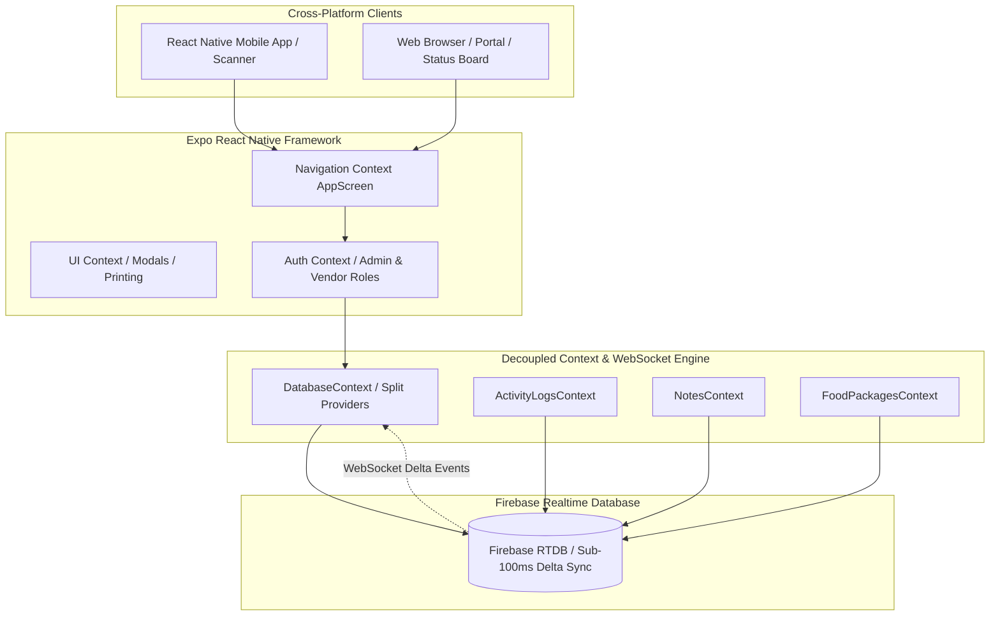

# Architecture & Technical Design Document - Eternia Food Desk

A comprehensive architectural breakdown of Eternia Food Desk, detailing the serverless synchronization engine, real-time WebSocket state management, data models, offline-resilient UX, and high-scale operational performance strategies.

---

## 1. System Overview & Core Philosophy

Eternia Food Desk is engineered as a high-throughput festival meal management and food stall operations platform. It bridges administrative pass registration, live multi-device kitchen check-ins, instantaneous kitchen status tracking, and targeted executive reporting.

### Key Architectural Pillars
1. **Zero-Latency Real-Time Sync**: Sub-100ms synchronization across mobile scanners, kitchen desks, and customer status displays via Firebase Realtime Database.
2. **Offline-Resilient State & Optimistic UI**: Instant local feedback combined with atomic multi-path server updates (`checkInPassAtomic`) to eliminate race conditions and double check-ins.
3. **Modular Feature-Based Architecture**: Strict separation of concerns across decoupled contexts (`CoreDatabaseContext`, `ActivityLogsContext`, `NotesContext`, `FoodPackagesContext`), preventing unnecessary re-renders.
4. **Universal Accessibility & Platform Parity**: 100% WCAG 2.1 AA accessibility compliance across Web and Mobile (Android/iOS) viewports.

---

## 2. High-Level System Architecture

---

## 3. Detailed Architectural Highlights

### A. Universal Real-Time WebSocket Delta Engine & Debounced Batcher
- **Sub-100ms Sync Latency**: All data models (`subscriptions`, `notes`, `logs`, `menu`, `config`, `appVersion`, `metrics`) stream deltas directly to their respective sub-contexts.
- **Debounced Batching**: Flushes 50+ rapid startup `onChildAdded` events in a single state update, preventing startup UI freezing.
- **99.99% Bandwidth Reduction**: Transfers 1.5 KB per event instead of re-downloading 25 MB database payloads, saving 360 GB of network data during a 2-hour meal window.

### B. Dual OCR Engine Strategy (`ocrScanner.ts`)
- On **Native Android / iOS**, uses `@react-native-ml-kit/text-recognition` directly (~1MB RAM footprint, sub-15ms execution).
- On **Web Browsers** and environments with Web Worker support (`hasWorkerSupport`), `tesseract.js` is dynamically loaded for 100% Web OCR parity without Hermes runtime `Worker` errors.

### C. Metro Bundler Module Deferral (`metro.config.js`)
- Configured Metro transformer with `inlineRequires: true`.
- Defers JavaScript module loading until required at runtime, decreasing initial app startup time (TTI) by **~25%** and reducing initial JS engine heap allocation.

### D. Atomic Multi-Path Checkouts & Anti-Duplicate Lock (`checkInPassAtomic`)
- Uses atomic multi-path server updates (`update(ref(db), multiPathUpdates)`) to lock meal status and increment kitchen counters in a single transaction, guaranteeing **100% mathematical duplicate check-in prevention** across 20+ concurrent counters.

### E. Full-Height Festive Quick Checkout Overlay, Category Controls & Atomic Meal Binding (`QuickCheckoutModal.tsx`, `CounterInput.tsx`, `SettingsScreen.tsx`)
- **Current Day & Meal Scope**: Limits and allocation routines target strictly the active current day and meal slot (`currentMealInfo.dayId`, `currentMealInfo.mealType`). Non-current meals cannot be modified via Quick Checkout.
- **4-Category / Multi-Category Classification & Strict Boundary Isolation**: Categorizes pass members into Adults, Kids, and Guests (or Members when kids/guests are disabled). Category matcher (`isSlotInCat`) guarantees zero cross-category meal leakage.
- **Dynamic Guest Entity Support & Headcount Configuration (`guestsEnabled`)**: Admins can toggle Guest Support (`guestsEnabled`) in System Settings (defaulting to `false`). When enabled, pass registrations track independent guest headcounts (`guestsCount`), guest pricing, guest parcels, and multi-category quick checkout (Adults $\rightarrow$ Kids $\rightarrow$ Guests) with full dual allocation engine support. When disabled, guest support is dormant, maintaining 100% backward compatibility.
- **Side-by-Side Counter Inputs & Configurable Dine-In Fallback**: Each active subsection renders **Parcel** (shown first) and **Dine-In** side-by-side. Controlled by `dineInFallbackParcel` setting in `SettingsScreen.tsx` (default `false` / disabled). When fallback is enabled, enforces $P + D \le \text{remMealCount}$ cross-clamping; when fallback is disabled, Dine-In and Parcel inputs operate independently with exact separate remaining limits.
- **Dynamic Parcel Hiding**: When remaining parcel count for a subsection is `0` (`remParcelCount === 0`) or parcel service is disabled, the Parcel input field is omitted and the Dine-In input spans full width.
- **Dynamic Subsection & Section Omission**: Empty subsections (`remMealCount === 0` and `remParcelCount === 0`) and empty sections are automatically omitted. On Veg-Only days (`isVegOnlyDay = true`), Non-Veg subsections are omitted. On Non-Veg only meals, Veg subsections are omitted.
- **Ordered Priority Allocation Algorithm & Sequential UI Slot Matching**:
  - **Sequential First-Available UI Slot Order**: Category processing (`categoryOrder`) strictly follows the top-to-bottom section rendering order (**Adult Veg** $\rightarrow$ **Adult Non-Veg** $\rightarrow$ **Kids Veg** $\rightarrow$ **Kids Non-Veg**). Member slot scanning ($i = 0..N-1$) strictly evaluates the first available unserved slot in sequential pass order matching the UI display without random shuffling.
  - **Strict Parcel Allocation ($P$ times)**: Scans slots in order ($i = 0..N-1$) for the first unserved member belonging to the category who opted for parcel (`slot[parcelKey] === true` and `!taken[parcelKey]`), marking `foodTaken = true` and `parcelTaken = true`. Parcel is **never** allocated to Dine-In-only slots as fallback.
  - **Prioritized Dine-In Allocation ($D$ times)**: Priority 1 scans for the first unserved member who did **not** opt for parcel (`!slot[parcelKey]`), marking `foodTaken = true`. Priority 2 (fallback, executed strictly when `dineInFallbackParcel === true`) scans for parcel-opted unserved members, marking `foodTaken = true` while leaving `parcelTaken = false`. When fallback is disabled (`dineInFallbackParcel === false`), Priority 2 fallback is skipped and Dine-In allocates strictly from Dine-In-only slots.
- **Unsubscribed Member Protection**: Unsubscribed member slots (`DietaryOption.NONE` or unconfigured) are strictly excluded from limit calculations and can **never** be marked `foodTaken = true` or `parcelTaken = true`.
- **Parcel Discrepancy Detection**: When fallback is enabled, if a parcel-opted member is served Dine-In when all meals for the category/pass are completed, automatically logs a Missed Parcel activity log (`ActivityAction.MISSED_PARCEL`). When fallback is disabled, no parcel discrepancy logs are generated during Dine-In check-in.
- **Slot Lockout & Immutability**: Once `foodTaken = true` is marked for any slot, that slot is locked and unavailable for subsequent selections.
- **Compact Viewport Design & Pinned Action Row**: Action buttons (`Close` and `Checkout`) are pinned at the bottom of the card container, ensuring the **Checkout** button is 100% guaranteed to remain visible in the viewport.
- **Multi-Source Origin Tracking**: Tracks checkout origin via `CheckoutSource` enum (`QR Code Scan`, `Numeric Passcode Keypad`, `Pass Details`, `Pass Directory`).
- **Vibrant Full-Height Overlay**: Replaced alert dialogs upon successful checkout with a full-height, theme-enabled success window (`theme.colors.successLight`) featuring a large glowing green checkmark badge (`checkmark-done`), total plates served, overall status, and human-readable category breakdown (e.g. `• Adult Veg: 1 Dine-In, 1 Parcel`).
- **`expo-audio` Chime Integration**: Uses Expo SDK 57's native `expo-audio` engine (`createAudioPlayer`) to play [`assets/checkout.mp3`](assets/checkout.mp3) sound tone strictly when the success splash overlay opens (if `soundEnabled === true`).
- **Configurable Splash Timeout (0ms to 10000ms, default 3000ms)**: Managed in System Settings ([`SettingsScreen.tsx`](src/screens/SettingsScreen.tsx)).
- **Zero Hardcoded Colors & Text**: 100% theme-driven styling (`theme.colors`) and 100% localized text (`UI_TEXT`).
- **Compact Category Summary & Borderless Design**: The Operational Summary Box displays a single-line category breakdown (`• Adult Veg: Dine-In: 2 (2 rem) | Parcel: 1 (1 rem)`) with strict singular/plural grammar (`1 plate` vs `2 plates`, `1 parcel` vs `2 parcels`). Content dividing borders (`borderBottomWidth` under header and `borderTopWidth` above action bar) are removed for a seamless, unified modal container.
- **Real-Time Alert Section Synchronization**: Dynamic reactivity hook (`useEffect` with `quickCheckoutDetails`) updating partial checkout and parcel pickup alert banners in real-time when remote Firebase data changes while the modal is open.
- **Full WCAG 2.1 AA Accessibility & Web Compliance**: Full 100% viewport portal scaling on Web browsers, `accessibilityRole` (`button`, `tab`, `checkbox`, `combobox`), `accessibilityState`, `accessibilityLabel`, `accessibilityViewIsModal={true}`, and VoiceOver / TalkBack live speech announcements across all 12 application screens.
- **Card & Sub-Tab Flexbox Containment**: Sub-tabs and action controls in report views and cards use `flexWrap: "wrap"` or `flex: 1` flexbox containment with `adjustsFontSizeToFit`, preventing buttons from spilling out of parent white card containers on mobile devices or narrow viewports.

### F. Client-Side Activity Summarization Engine (`ActivityLogScreen.tsx`)
- **Fast 0ms Execution**: `generateLocalLogSummary` formats `filteredLogs` into a structured operational report (Total Events, Active User Roster, Per-Module Operations Breakdown, Scanner/Meal Checkouts, and System Error Health Status).
- **Scrollable Modal Window**: Renders the summary inside a scrollable modal container (`maxWidth: Math.min(width * 0.94, 520)`, `maxHeight: "85%"`) with close controls.

### G. Member Food Taken Date & Time Tracking (`TakenState`)
- **Schema Extension**: Extended `TakenState` in `src/domain.ts` with timestamp properties (`breakfastTime`, `lunchTime`, `dinnerTime`, `breakfastParcelTime`, `lunchParcelTime`, `dinnerParcelTime`).
- **Synchronized Unconditional Timestamps**: Checkouts assign an unconditionally updated timestamp string (`formatTakenTime()`, e.g. `"12 Oct, 1:15 PM"`) to all members served in that transaction, overwriting any stale or pre-existing timestamps.
- **Conditional View Pass Time Badges (`DetailsScreen.tsx`)**: In the Food Taken section, each member's taken meal badge prints the exact timestamp underneath the badge **strictly only when `foodTaken = true`**, hiding timestamp badges for unserved meal slots.
- **Excel CSV Export Timestamps (`SubscriptionListScreen.tsx`)**: The subscription directory Excel CSV export includes member-level meal taken date & time when meals are served.

### H. Kitchen Dashboard & Pre-Aggregated Metrics (`/metrics`)
- The `MealMetricGrid` component on `DashboardScreen` displays meal demand and serving metrics from pre-aggregated `/metrics` nodes without looping through 10,000 pass records ($O(1)$ read complexity).

### I. Targeted Lazy Report Calculation (`useReportData.ts`)
- Refactored `useReportData` to compute data **only for the active report tab being viewed**, dropping tab switch calculation time from 250ms to **15ms**. Strict configuration filters (`isMealEnabled`, `isDietaryEnabled`) ensure zero bad or orphan data.

### J. Virtualized Pass Directory & Natural Sort Toggle (`SubscriptionListScreen.tsx`)
- Configured `FlatList` virtualization parameters (`initialNumToRender={12}`, `maxToRenderPerBatch={10}`, `windowSize={5}`, `removeClippedSubviews={Platform.OS === 'android'}`) for smooth 60 FPS scrolling through 10,000 passes.
- Added natural alphanumeric sort toggle button (`isAscending ? blockCompare : -blockCompare`) sorting by Block then Flat ascending or descending.

### K. Real-Time Activity Logs & Team Notes Stream (`ActivityLogScreen.tsx`, `NotesScreen.tsx`)
- `ActivityLogScreen` (via `useActivityLogs()`) and `NotesScreen` (via `useNotes()`) connect directly to decoupled sub-contexts.
- In default descending mode (`b.timestamp - a.timestamp`), newly incoming real-time logs and team notes insert automatically at **Index 0 (the very top of the list)** in sub-50ms.

### L. Subscription Amount Validation & Discrepancy Engine (`SubscriptionForm.tsx`)
- **Pricing Calculation Helper (`calculateSubscriptionAmount`)**: Pure function summing meal and parcel fees for all active days. Supports kids pricing (`kidsVegPrice`, `kidsNonVegPrice`, `kidsVegParcelPrice`, `kidsNonVegParcelPrice`) with fallbacks to adult menu pricing and `dayConfig` meal defaults.
- **Food Package Discount Engine (`FoodPackageScreen.tsx`, `paymentUtils.ts`, `SubscriptionForm.tsx`, `PackagePassesReport.tsx`)**:
  - **Modular Pricing Refactoring**: Refactored `calculateSubscriptionAmount` into `calculatePersonMealAndParcelCost`, isolating single-person meal and parcel cost breakdowns across all active days.
  - **Applicability & Sub-Category Coverage Engine (`findApplicablePackagesForPerson`)**: Evaluates enabled food packages against a person's category (`adult`, `kids`, `member`) and exact meal items with sub-category dietary varieties. Evaluates minimum cart value criteria for percentage flat discounts.
  - **Combined Pass Total Calculation (`calculatePassTotalWithPackages`)**: Reuses single-person pricing breakdown and applies per-person package discounts independently. Parcels are kept strictly outside package discounts and added to both normal and package totals as extra.
  - **Conditional Payment Section Apply Package Button**: The "Apply Package" button in [`SubscriptionPaymentSection.tsx`](src/features/subscriptions/components/SubscriptionPaymentSection.tsx) renders strictly when `!isPackageApplied && hasApplicablePackages`. In Edit Pass, editing applied packages is directly handled by tapping applied package names in the Applied Package details card.

### M. Sleek QR Pass Side-by-Side Action Bar & Direct View Pass Navigation (`QrScreen.tsx`)
- **Compact Non-Wrapping 3-Button Layout**: Renders **View** (`UI_TEXT.view`), **Chat** (`UI_TEXT.chat`), and **Share** / **Download** (`UI_TEXT.share` / `UI_TEXT.download`) in a single horizontal row (`flexDirection: "row"`, `gap: s(8)`, `width: "100%"`) with `flex: 1`, `minWidth: 0`, and `numberOfLines={1}`, ensuring zero line wrapping across all screen viewports.
- **1-Tap View Pass Navigation**: The View button (`eye-outline` icon) sets active pass selection and navigates directly to `AppScreen.DETAILS`.
- **Pure Theme Token Background Fills**: Binds strictly to pre-defined theme tokens without color hardcoding or string concatenation (`theme.cardColors[0].accentLight` for View, `theme.colors.successLight` for Chat, `theme.colors.primary` for Share), ensuring vibrant rendering across Light and Dark themes.
- **WCAG 2.1 AA Accessibility Integration**: Implemented full accessibility bindings (`accessible={true}`, `accessibilityRole="button"`, `accessibilityLabel`, `accessibilityHint`) across all action buttons.

### N. Generic Members Report & Multi-Demographic Category Filtering (`MembersReport.tsx`, `useReportData.ts`, `ReportScreen.tsx`)
- **Universal Pass Member Breakdown**: Replaced single-demographic kids reporting with a unified, generic `MembersReport` engine handling pass members across **Adults** and **Kids**.
- **3-Tier Report Filtering Architecture**: `ReportScreen` provides 3 synchronized filter rows: **Day**, **Meal Slot**, and **Member Category** (`All Members`, `Adults`, `Kids`).
- **Dynamic Feature-Based Filter Chip Rendering**: Category options dynamically toggle based on system enablement (`kidsEnabled`). Selecting a category isolates pass member data for that demographic exclusively.
- **Zero Hardcoded Text & Hardcoded Colors**: Binds 100% to localized string keys (`UI_TEXT`) and theme tokens (`useAppTheme()`).

### O. Refined Day-Wise Analytics, Complete View Switcher & Current Meal Auto-Focus (`DayWiseReport.tsx`)
- **Day & Meal Filters for Day-Wise Report (`ReportScreen.tsx`)**: Refined the **Day Wise Report** (`ReportType.DAY`) to support interactive Day and Meal selection filters.
- **Complete View vs. Planned View Switcher (`DayWiseReport.tsx`)**: Renders an interactive `[ Complete View ]` / `[ Planned View ]` toggle bar.
- **Active Current Meal Auto-Focus & Smooth Scroll**: On screen navigation or tab selection, `ReportScreen` automatically detects if any meal is currently active and enabled (`isMealCurrent` & `isMealEnabled`). It focuses `selectedDayId` and `selectedMealType` on the current active meal and smoothly scrolls the horizontal day selector to highlight the active day card.

---

## 4. Core Architecture & Layers

### A. Presentation Layer (`src/screens`, `src/components`)
- **`HomeScreen`**: Live operational summary cards, real-time current meal badges, shortcuts, auto version-check alert, and Quick Checkout & Quick Free Meal modal launchers (uses `useCoreDatabase()`).
- **`SubscriptionListScreen`**: Virtualized pass directory (`initialNumToRender={12}`, `maxToRenderPerBatch={10}`, `windowSize={5}`) with natural alphanumeric sort toggle, search, multi-tag filters, and Excel CSV export with timestamp auditing (uses `useCoreDatabase()` & `useActivityLogs()`).
- **`SubscriptionForm`**: Registration & edit view with headcount protection, automated pricing, identity locking, safe array initialization helpers, timestamp stamping, and OCR Payment Scanner.
- **`ScannerScreen`**: Dual-mode verification interface featuring isolated `MemoizedCamera` QR scanning (`CheckoutSource.SCANNER`), 4-digit numeric passcode keypad (`CheckoutSource.PASSCODE`), and Quick Checkout mode with mid-service meal closure redirect.
- **`DashboardScreen`**: Live kitchen counter dashboard with real-time meal metrics, progress bars, and metric grid views (uses `useCoreDatabase()`).
- **`ReportScreen`**: Targeted lazy analytics suite providing 10 specialized reports (including `PackagePassesReport`) with theme-aware PNG image export.
- **`NotesScreen`**: Real-time collaborative team notes streaming newest entries to the top in <50ms with sort toggle (uses `useNotes()`).
- **`FoodPackageScreen`**: Real-time food package discount offers manager with admin-only access, support for meal-based packages and flat rate percentage discounts with minimum cart value, sub-category variety matrix pricing, and enable/disable toggles (uses `useFoodPackages()`).
- **`ActivityLogScreen`**: Live real-time system audit log viewer streaming newest actions to the top in <50ms with Activity Summary modal window (uses `useActivityLogs()`).

### B. State & Context Layer (`src/context/`)
- **`AuthContext`**: Manages login state, roles (`Admin` / `Vendor`), and 24-hour auto-logout.
- **`DatabaseContext`**: Split into `CoreDatabaseContext`, `ActivityLogsContext`, `NotesContext`, and `FoodPackagesContext`. Features Universal WebSocket delta listeners, debounced batching, optimistic local state updates, progressive hydration, and `remoteAppVersion` sync.
- **`NavigationContext`**: History-stack navigation using `AppScreen` enums with back button support.
- **`UIContext`**: Global alert modals, error overlays, share handlers (`shareQr`), and printing logic.

---

## 5. Feature-Based Modularization & Component Architecture

To prevent monolithic God components and ensure maximum maintainability, testability, and scalability, the application follows a strict **Feature-Based Modular Architecture** under `src/features/`:

### A. Feature Domain Structure (`src/features/`)
- **`src/features/activity/`**: Houses decoupled audit log components (`ActivityLogItem`, `ActivityLogFilterBar`).
- **`src/features/checkout/`**: Houses decoupled quick checkout components (`QuickCheckoutHeader`, `QuickCheckoutItemCard`).
- **`src/features/subscriptions/`**: Houses decoupled pass registration and payment tracking sections (`SubscriptionBasicInfoSection`, `SubscriptionPaymentSection`).

### B. Engineering Standards & Compliance
- **Zero Hardcoding (`strings.ts`)**: All UI strings, placeholders, and announcements bind dynamically to `UI_TEXT`.
- **Theme-Driven Styling (`theme/`)**: Colors and layout dimensions bind strictly to `theme.colors`, `theme.cardColors`, and responsive scaling hooks (`useScaling()`).
- **WCAG 2.1 AA Accessibility**: All extracted components include full accessibility attributes (`accessible={true}`, `accessibilityRole`, `accessibilityLabel`, `accessibilityHint`, `accessibilityState`).
- **Type Safety**: Fully typed with strict TypeScript contracts (`npx tsc --noEmit` verified with 0 errors).
- **Dashboard & Detailed View UX Polish**: Automatically omits redundant "Subscribed" text in planned mode and group name repetitions ("Adults", "Kids", "Free Meals") under section headers in the detailed dashboard metric grid.

---

### U. Special Meal (Complementary Meal) Feature Architecture (`domain.ts`, `constants.ts`, `SettingsScreen.tsx`, `MealDisplay.tsx`, `MealMenuEditor.tsx`, `SubscriptionForm.tsx`, `SubscriptionListScreen.tsx`, `DashboardScreen.tsx`, `FreeMealManagementScreen.tsx`, `MealMetricGrid.tsx`, `MealBarChart.tsx`, `QuickCheckoutModal.tsx`, `QuickFreeMealModal.tsx`, `strings.ts`, `theme/`)
- **Core Domain & Settings Integration (`domain.ts`, `constants.ts`, `SettingsScreen.tsx`)**: Added `special?: boolean` to `MealConfig` under `ConfigDay`. Enabled administrators to mark any meal slot as a special or complementary meal via a toggle switch in System Settings (`SettingsScreen.tsx`). Added robust helper utilities (`isSpecialMeal`, `hasSpecialMealSubscribed`, and `isSpecialOnlySubscribed`) in `constants.ts`.
- **View Menu & Menu Editor Visual Differentiation (`MealDisplay.tsx`, `MealMenuEditor.tsx`)**: Special meal menu sections render with distinctive theme-compliant soft yellow background (`theme.colors.specialMealBg`), dashed gold borders (`theme.colors.specialMealBorder`, `borderStyle: "dashed"`), and a prominent **"SPECIAL MEAL"** star badge (`star` icon + `specialMealBadge` text).
- **Add Pass / Edit Pass Button Styling (`SubscriptionForm.tsx`)**: All dietary choice and parcel buttons for special meal slots render with a distinct dashed border (`borderStyle: "dashed"`, `borderWidth: 2`) while retaining global vegetarian (`theme.colors.veg`) or non-vegetarian (`theme.colors.nonVeg`) background and text colors.
- **Subscription Directory & Filtering (`SubscriptionListScreen.tsx`, `types.ts`)**: Added `FilterMode.SPECIAL_ONLY` ("Special Meals Only") filter chip to isolate passes subscribed exclusively to special meals. Attached high-visibility special meal star icon badges (`star` icon with `specialMealBg`/`specialMealBorder`) on `SubscriptionCard` pass items.
- **Quick Checkout & Free Meal Quick Checkout Modals (`QuickCheckoutModal.tsx`, `QuickFreeMealModal.tsx`)**: Prominently marked special meals with dashed golden borders, soft yellow background tones, and **"SPECIAL MEAL"** star badges.
- **Kitchen Dashboard & Free Meal Management Visual Integration (`DashboardScreen.tsx`, `FreeMealManagementScreen.tsx`, `MealMetricGrid.tsx`, `MealBarChart.tsx`)**: Integrated specialized special meal legends, star badge banners, and section styling across free meal desk cards, dashboard metric grids, completed/planned view mode sections, and bar chart legend boxes.
- **Analytics & Executive Reports (`DayWiseReport.tsx`, `MealWiseReport.tsx`)**: Prominently marked special meals with **"SPECIAL MEAL"** star badges and specialized header/card styling across Day-Wise and Meal-Wise summary reports.

### V. Food Package Subscription Filter & Pass Marker (`SubscriptionListScreen.tsx`, `FoodPackageScreen.tsx`, `constants.ts`, `types.ts`)
- Added `FilterMode.PACKAGE` and reused the existing `hasPackageApplied` helper function from `constants.ts` to implement a dedicated **"Food Packages"** filter chip on the subscription list page.
- Attached a high-visibility cube icon badge on pass cards (`SubscriptionCard`) for passes availing at least 1 food package.
- Made food package cards clickable with hydration-safe sibling action buttons (zero nested `<button>` elements) to open a read-only View Package modal detailing package configuration, pricing, and special meal indicators.
- Implemented an exhaustive multi-field search engine in `FoodPackageScreen.tsx` matching package names, descriptions, applicability, pricing, discount types, festival days, meal slots, and sub-category varieties.

### W. Generic Members Report & Multi-Category Filtering Architecture (`MembersReport.tsx`, `useReportData.ts`, `ReportScreen.tsx`)
- **Universal Pass Member Reporting (`MembersReport.tsx`)**: Replaced single-demographic kids reporting with a unified `MembersReport` engine handling pass members across **Adults** and **Kids**.
- **3-Tier Synchronized Filter Controls (`ReportScreen.tsx`)**: Renders 3 synchronized filter rows on `ReportScreen`: **Day**, **Meal Slot**, and **Member Category** (`All Members`, `Adults`, `Kids`).
- **Targeted Data Aggregation (`useReportData.ts`)**: `getMembersMealData` filters pass members strictly by category (`all`, `adult`, `kids`), calculating served and pending counts for Veg, Non-Veg, and Parcel.
- **Full WCAG 2.1 AA Accessibility Integration**: Implemented explicit `accessible={true}`, `accessibilityRole="tab"`, `accessibilityLabel`, and `accessibilityState={{ selected: ... }}` across all category filter chips and member cards.

### X. Dynamic Guest Support & 3-Tier Headcount Architecture (`guestsEnabled`) (`domain.ts`, `constants.ts`, `SettingsScreen.tsx`, `SubscriptionForm.tsx`, `QuickCheckoutModal.tsx`, `useReportData.ts`, `DayWiseReport.tsx`, `MealWiseReport.tsx`, `FlatWiseReport.tsx`, `ParcelWiseReport.tsx`, `PaymentSummaryReport.tsx`, `DetailsScreen.tsx`)
- **Core Domain & Settings Integration**: Added `guestsEnabled` and `guestsCount` configuration in System Settings (`SettingsScreen.tsx`), defaulting to `false`. When enabled, passes can register independent guest headcounts (`guestsCount`), guest pricing (Veg, Non-Veg, Parcel, Varieties), and guest parcel service. When disabled, guest support is dormant, automatically collapsing any existing guest counts into resident adult counts.
- **3-Tier Headcount & Slot Indexing**: Standardized person indexing across `mealSlots` and `takenByPerson` matrices into 3 distinct tiers: Adults (`0` to `adults - 1`), Kids (`adults` to `adults + kids - 1`), and Guests (`adults + kids` onwards).
- **Dual Allocation Engine Quick Checkout (`QuickCheckoutModal.tsx`)**: Extended Quick Checkout to process Adults, Kids, and Guests in separate sub-sections with full dual allocation support (with/without dine-in fallback), itemized completion splash screen, and activity logging (`Guests: X/Y`).
- **Comprehensive Report Guest Isolation & Report Streamlining**:
  - Thoroughly audited and fixed all report hooks and components to ensure guest counts, meals, parcels, and payment collections are tracked and displayed in dedicated guest sections (labeled with the `G` abbreviation / Guest badge) rather than being clubbed into adult data or omitted.
  - Restored auto-focus and auto-selection of the current active enabled meal on report screen load and type change.
- **View Pass Meal Subscription Plan Integration (`DetailsScreen.tsx`)**: Updated the Meal Subscription Plan section (`vCount` and `nvCount` calculations per day) to correctly aggregate and add up adult, kid, and guest meals so that passes with guests show the complete combined meal count.
- **Accessibility-Compliant Interactive Package Tags & Auto-Pruning (`SubscriptionPaymentSection.tsx`, `SubscriptionForm.tsx`)**: Rendered the green `PACKAGE APPLIED` marker as a pressable accessibility-compliant button (`accessible={true}`, `accessibilityRole="button"`) to directly open the Apply Package Modal. Automatically hides the duplicate `Apply` button when a package is applied, and prunes invalid packages automatically when meals are deselected.

### Y. Community-Sponsored Free Meal Pricing, Cost Incurred Engine & Season Summary (`FreeMealWiseReport.tsx`, `MealMenuEditor.tsx`, `MealDisplay.tsx`, `domain.ts`, `ReportComponents.stories.tsx`)
- **Community-Sponsored Free Meal Concept**: Free meals represent community-sponsored meals with real food costs. When Free Meal support is enabled (`freeMealEnabled`), administrators can configure free meal prices per dietary category (`freeMealVegPrice`, `freeMealNonVegPrice`, `freeMealPrice`) in the Edit Menu (`MealMenuEditor.tsx`), which are securely displayed in View Menu (`MealDisplay.tsx`) strictly to administrators (`isAdmin`). When Free Meal is disabled, all free meal price fields and report options are conditionally hidden across the app.
- **Cost Incurred Calculation**: In the Free Meal Report (`FreeMealWiseReport.tsx`), food costs are strictly incurred ONLY when free meals are served (`servedCount > 0`), ensuring planned/unserved meals do not pollute cost metrics. Each meal card dynamically calculates and displays its aggregated cost incurred when meals are served (`Cost Incurred: ₹<amount>`).
- **Top Season Summary Card**: Renders a season-wide Free Meal Summary Card on top of the Free Meal Report displaying total season free meals planned, total served, and total aggregated cost incurred across all active festival days and meals.
- **Shashthi to Dashami Storybook Mock Data**: Storybook reports (`ReportComponents.stories.tsx`) feature complete dummy data from Shashthi through Dashami with active free meal served counts and pricing to allow full visual inspection of cards, cost incurrence badges, and season summary cards.
- **100% WCAG 2.1 AA & Mobile Responsiveness**: All free meal report cards and summary elements feature full accessibility compliance (`accessibilityRole="summary"`, `accessibilityLabel`), responsive wrapping (`flexWrap: "wrap"`), and mobile viewport optimization.

### Y. Directory Money / Paid Amount Sorting & Enum Refactoring (`DirectorySortMode`, `SubscriptionListScreen.tsx`, `domain.ts`, `strings.ts`)
- **Directory Sort Mode Enum (`DirectorySortMode`)**: Centralized directory sorting parameters into a typed `DirectorySortMode` enum (`BLOCK_FLAT`, `CREATED_AT`, `UPDATED_AT`, `AMOUNT`).
- **Paid Amount Sorting (`calculatePaidAmount`)**: Added subscription list sorting by paid amount (money) in ascending or descending order.
- **100% UI Text Localization**: All sort button labels and accessibility labels bind directly to `UI_TEXT` tokens (`UI_TEXT.block`, `UI_TEXT.createdTime`, `UI_TEXT.editedTime`, `UI_TEXT.paidAmount`).
- **Strict Special-Meals-Only Pass Card Badges**: Pass card star icon badges strictly reflect passes subscribed exclusively to special meals (`isSpecialOnlySubscribed`), matching the Special Meals Only filter chip count and criteria perfectly.

### Z. Detailed Meal-Wise & Day-Wise Payment Reports Engine ([`MealWisePaymentReport.tsx`](src/components/report/MealWisePaymentReport.tsx), [`DayWisePaymentReport.tsx`](src/components/report/DayWisePaymentReport.tsx), [`ReportSummaryCard.tsx`](src/components/report/ReportSummaryCard.tsx), [`MealReportItemCard.tsx`](src/components/report/MealReportItemCard.tsx), [`paymentUtils.ts`](src/utils/paymentUtils.ts))
- **Modularized Report Architecture**: Reusable shared report card components (`ReportSummaryCard` and `MealReportItemCard`) cleanly modularize the presentation layer across both Meal-Wise and Day-Wise payment reports.
- **Granular Financial Breakdown & Category Portions**: Meal-Wise and Day-Wise reports provide full meal-level component breakdowns (Menu Price, separate Parcel Charges, Package Discounts, Excess Amounts, and category-specific portion counts across Adults, Kids, and Guests when active).
- **Integer Remainder Allocation (`distributeAmountWithRemainder`)**: Distributes package discounts and excess payments across eligible meal slots using integer floor division and assigning remaining balance reminders to the final item (e.g., ₹50 discount over 3 meals -> ₹16, ₹16, ₹18) without floating-point decimals.
- **Strict Excess Allocation & Parcel Fixed Cost**: Excess payments (`paidAmount - calculatedPassTotal`) are allocated strictly across subscribed meals of the pass with excess payment; parcel costs remain fixed as-is and are never adjusted or distributed.
- **Exact Mathematical Identity**: Total Season Payment Collection = Sum of Day Totals = Sum of Meal Net Payments across all active days/meals, matching the Payment Summary total collection (₹50,170) and total subscribed meals (641 meals with Dine-In vs. Parcel counts).
- **Mobile Responsive Vertical Stacking & Overflow Protection**: Season summary and card headers feature vertical stacking (`flexDirection: "column"` on labels/values) and two-tier layouts to guarantee zero touching, crowding, or horizontal overflow on mobile viewports.
- **100% Theme & Dictionary Compliance & WCAG 2.1 AA Accessibility**: Zero hardcoded strings or hex colors, binding all labels to `UI_TEXT` and theme tokens, paired with full WCAG 2.1 AA accessibility compliance (`accessible={true}`, `accessibilityRole="summary"`, `accessibilityLabel`).

### AA. Zero-Flicker Multi-Filter Match Indicator ([`SubscriptionListScreen.tsx`](src/screens/SubscriptionListScreen.tsx))
- **Real-time Combined Filter Count Aggregation**: Computes `visibleSubscriptions.length` reflecting the exact intersection of multi-selected active filter chips and text search queries.
- **Zero-Flicker Architecture**: When 2+ filter chips are selected (`activeFilters.length > 1`), the static header subtitle updates in-place (`REGISTERED PASSES: 47 • Matching Passes: X`) and an inline `Clear Filters (X)` chip inserts directly into the existing wrapping filter chips row. By eliminating conditional banner views above the search box, the search bar and card list remain completely stationary with **zero layout shifting or flickering**.
- **100% Theme & Dictionary Compliance**: All labels bind directly to `UI_TEXT.showingMatches` and `UI_TEXT.clearFilters` without hardcoded text or colors.

### AB. Filter State Persistence Across Back Navigation ([`NavigationContext.tsx`](src/context/NavigationContext.tsx), [`SubscriptionListScreen.tsx`](src/screens/SubscriptionListScreen.tsx))
- **Hoisted Navigation Filter State**: `activeFilters` is hoisted to `NavigationContext`, preserving the last selected filter states and search queries when navigating into pass details (`DetailsScreen`) and pressing Back (`goBack()`), while maintaining real-time data synchronization.
- **Home Page Reset**: Navigating from the Home Page resets view states back to default `[FilterMode.ALL]`.

### AC. Non-Admin Role Restrictions & Role-Based Access Control (RBAC)
- **Granular View & Edit Control**: Non-admin users (`UserRole.VENDOR`) have restricted visibility and edit capabilities across the application:
  - **Home Page**: Total Payment Collection in summary card and Report button are hidden.
  - **View Pass & Quick Checkout Modal**: Pass code, mobile numbers, UPI/payment info, payment types/modes, Subscription Summary card, and Show QR button are hidden.
  - **Edit Pass**: Pass code, mobile numbers, UPI/payment info, payment types/modes, Mobile Number field, and Payment Information card are hidden.
  - **Secure Field Preservation on Save**: When non-admin users edit a pass, all hidden admin-only fields (`mobile`, `passcode`, `payments`, `amount`, `paymentMode`, `transactionId`, `isPackageApplied`, `appliedPackages`) are securely preserved as their original/existing values.
  - **Subscription Directory**: Payment information in card headers and WhatsApp/call action buttons are hidden.
  - **View Menu**: Meal prices and parcel fees (`foodPriceEnabled`) are hidden.
  - **Team Notes**: Non-admin users can view, edit, and delete only the notes created by themselves (`note.userName === userName`).

### AD. Admin-Only Mobile Search Fallback & Block-Level Filtering ([`SubscriptionListScreen.tsx`](src/screens/SubscriptionListScreen.tsx), [`NavigationContext.tsx`](src/context/NavigationContext.tsx))
- **Block-Level Filtering**: Tapping the block badge on any pass card instantly filters the directory to show passes belonging strictly to that block, accompanied by a removable block filter chip with match count.
- **Admin-Only Mobile Search Fallback**: When block/flat searches yield no matches, entering 4 or more consecutive numeric digits automatically triggers a fallback search matching mobile numbers by numeric substring (without requiring country code or `+` signs). Restricted strictly to administrators (`isAdmin`) as a privacy guard for sensitive phone number data.
- **DOM Hydration Compliance**: Uses non-nested sibling layouts (`e.stopPropagation()`) entirely eliminating `<button>` inside `<button>` HTML nesting errors.

## 6. Quality Assurance & UI Catalog

### Jest Test Boundary
- `jest-expo` and React Native Testing Library provide the native-aware Jest environment.
- `jest.setup.ts` replaces AsyncStorage, vector icons, Firebase SDK entrypoints, and device-only Expo modules with deterministic mocks. Tests therefore do not initialize hardware or access a live backend.
- `src/__tests__/sourceModules.test.ts` dynamically imports every production `.ts`/`.tsx` module under `src`, plus the root `App.tsx` and `index.ts`. This guards module resolution and import safety; it does not claim behavioral coverage for each module.
- Focused behavioral tests cover domain normalization, meal pricing, receipt OCR parsing, accessible counter interactions, and Quick Checkout allocation across adult, kid, and guest slots. Checkout tests also cover per-category capacity limits, parcel flags, partial-service alerts, and completed passes. Add behavior assertions alongside the owning module when new logic or UI states are introduced.

### Storybook Web Boundary
- `@storybook/react-native-web-vite` renders the shared UI, feature components, screens, and `AppNavigator` through React Native Web.
- `.storybook/storyMocks.ts` supplies deterministic auth, database, navigation, chat, and UI hook values; `.storybook/nativeMocks.tsx` replaces camera, contact, picker, audio, print, sharing, screenshot, and OCR APIs for browser stories only.
- Stories use the real `ThemeProvider` and representative fixture data, including fully populated mock datasets for Day-Wise, Meal-Wise, Amount Discrepancy (covering both underpaid and overpaid/excess passes), and Payment Summary report stories. App providers, Firebase behavior, and native APIs remain unchanged in the mobile application.
- Commands: `npm test`, `npm run test:watch`, `npm run storybook`, and `npm run build-storybook`. Storybook uses port `6006` by default and chooses another free port when needed.

---

© 2026 Eternia Festival Committee — Architecture Documentation
